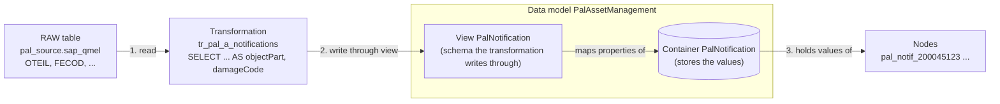

# Data Model Update — L100 Assignment

Module: `modules/examples/platform-alpha`. Commands are in [RUNBOOK.md](RUNBOOK.md).

## Task

Maintenance notifications tell us what went wrong on a pump. SAP records which part failed (`OTEIL`) and the damage code (`FECOD`). An engineer or an agent needs that to answer "has this happened before, and what was the failure?"

That data is in RAW (`pal_source.sap_qmel`) but not in the data model yet.

**View to update:** `PalNotification`. It has 10 properties of its own today: `notificationNumber`, `notificationType`, `priority`, `shortText`, `longText`, `createdDate`, `requiredStartDate`, `requiredEndDate`, `breakdownIndicator`, `status`.

**Add 2 new properties** (both text):

| New property | RAW column |
|---|---|
| `objectPart` | `sap_qmel.OTEIL` |
| `damageCode` | `sap_qmel.FECOD` |

Result: `PalNotification` goes from 10 to 12 own properties, and the notification nodes carry the failed part and damage code.

## How the data gets there

1. **Update the schema first:** add the 2 properties to the container, map them in the view.
2. **Deploy the schema** to CDF.
3. **Run the transformation.** It reads RAW and writes the notification nodes through the view, filling the new properties. The SQL already selects both columns, so you do not change it.



- **Container:** physical storage and its properties.
- **View:** maps container properties. The transformation writes through it.
- **Data model:** the collection of views.
- **Node:** one notification, with its values stored in the container.

Your change is inside the data model box: add the properties to the container, map them in the view. The transformation and RAW stay as they are.

## Steps

All paths are under `modules/examples/platform-alpha/`.

### Part 1 — Update the schema
1. **Container.** In `data_modeling/pal-sap-apm-dm/containers/PalNotification.Container.yaml`, add `objectPart` and `damageCode` (text).
2. **View.** In `data_modeling/pal-sap-apm-dm/views/PalNotification.View.yaml`, map `objectPart` and `damageCode` to that container.
3. **Check the transformation.** In `transformations/population/tr_pal_a_notifications.Transformation.sql`, confirm `OTEIL` is aliased `objectPart` and `FECOD` is aliased `damageCode`. Change it only if the names do not match yours.

### Part 2 — Deploy the schema
```bash
cdf build -c config.pal.yaml
cdf deploy --dry-run --verbose --include data_modeling   # read the diff: additive only
cdf deploy
```

### Part 3 — Populate the data model
- **CLI:** `cdf run transformation -e tr_pal_a_notifications`
- **or GUI:** CDF, Transformations, `tr_pal_a_notifications`, Run.

### Part 4 — Check
Open notification `200045123` in CDF.

| Property | Expected |
|---|---|
| `objectPart` | `DE bearing` |
| `damageCode` | `BRG-WEAR` |

## Lessons

- **Schema first, data second.** The model defines where data can live. Update it, then load.
- **Containers store, views map.** A property must be in the container and mapped in the view.
- **Transformations are repeatable.** Running one again updates existing nodes. Nothing is recreated.
- **Adding properties is safe.** Existing data is untouched.
- **Dry-run before deploy.** `--verbose` shows exactly what will change.
